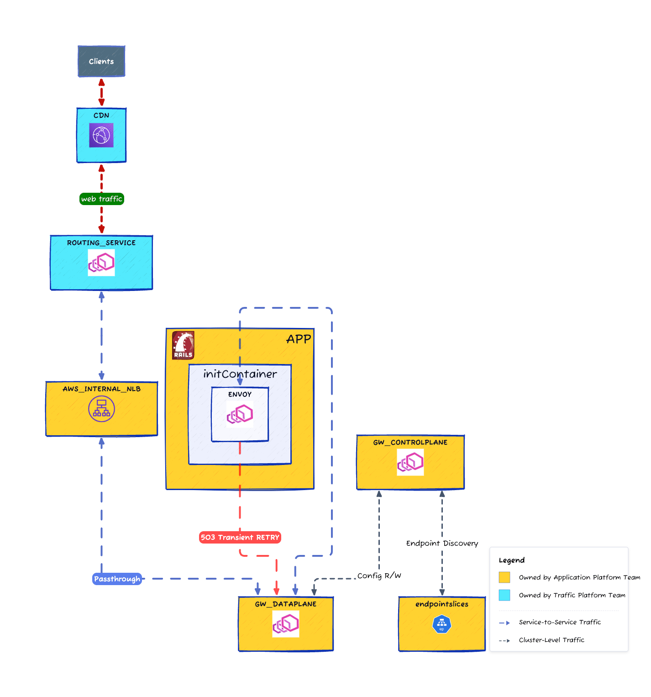

# Web Application Workload

This directory contains the Kubernetes manifests and Kustomize configurations for the web application workload. The configuration demonstrates zero-downtime migration techniques using progressive enhancement with Kustomize overlays.

**Labels**:

- `app.kubernetes.io/component: web`
- `app.kubernetes.io/system: platform-service`

## Architecture

### Current



### Future


## Kustomize Overlay Strategy

### Phase 1: Base Manifest (`base-manifest/`)

**Purpose**: Clean deployment with lifecycle hooks for preStop with sleep X.

### Phase 2: Lifecycle Hooks (`lifecyle-hooks/after-native-sidecar`)

**Purpose**: Add graceful shutdown capabilities for zero-downtime deployments.

**Patches Applied**:

- **PostStart Hook**: Undo preStop actions, helpful during container(not POD) restarts
- **PreStop Hook**: Graceful connection draining sequence
  1. Signal Envoy to stop accepting new connections
  2. Wait for active connections to drain
  3. Complete shutdown process

### Lifecycle Hook Implementation

**PostStart**:

```bash
curl -s -X POST "http://envoy:9901/healthcheck/ok"
```

**PreStop**:

```bash
# Signal Envoy to stop accepting connections
curl -s -X POST "http://envoy:9901/healthcheck/fail"

# Wait for active connections to drain
while [[ $(curl -s envoy:9901/stats | grep server.total_connections | awk '{print $2}') != 0 ]];
do sleep 1; done;
```

## Usage Examples

### Apply Base Configuration

```bash
kubectl apply -k base-manifest/
```

### Apply with Lifecycle Hooks

```bash
kubectl apply -k lifecycle-hooks/after-native-sidecar/
```

### Validate Configuration

```bash
# Check what will be applied
kubectl kustomize .

# Validate syntax
kubectl kustomize . | kubectl apply --dry-run=client -f -
```

## References

- [Kubernetes Native Sidecar Containers](https://kubernetes.io/blog/2023/08/25/native-sidecar-containers/)
- [Kubernetes Container Lifecycle Hooks](https://kubernetes.io/docs/concepts/containers/container-lifecycle-hooks/)
- [Kustomize Documentation](https://kubectl.docs.kubernetes.io/references/kustomize/)
